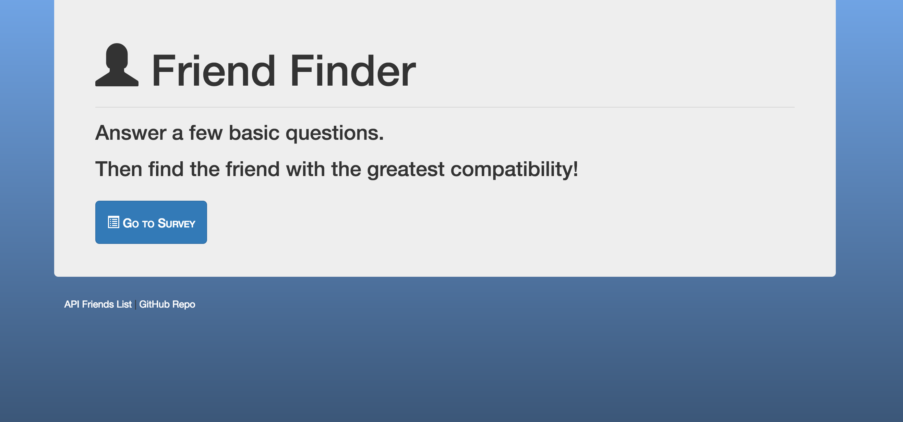

# FriendFinder

A mock up of an online friendship matching system that operates a server from user's localhost. When the user enters the `/survey` path, they aer required to enter a name and photo link. Then they are asked to take a personality quiz where they rate how much they agree with the statements. When they submit, their questions, the server takes their responses and compares them to answers given by all others in the `friends.js` file.  The difference between each user answer from each friend's answer is summed to give the compatibility score, where a lower number equals high compatibility.

To run the app locally, simply download and run the command `npm start` in the root directory. The console will output "App is listening on port 3000'. Simply enter `locoalhost:3000` in your favorite browser and you can take the quiz. 

